# Yeobun


[](https://github.com/n6-studio/yeobun/releases/latest)
[](https://n6.studio/)

**A Control Center–style panel in the menu bar for the extras macOS did not ship. No Dock icon.**  
Lock the built-in keyboard. Reverse mouse scroll. Stay on with the lid closed. Keep the Mac awake. Hide menu bar icons behind a chevron. Glance at this Mac.

*Yeobun* is from Korean **여분**: spare, extra.


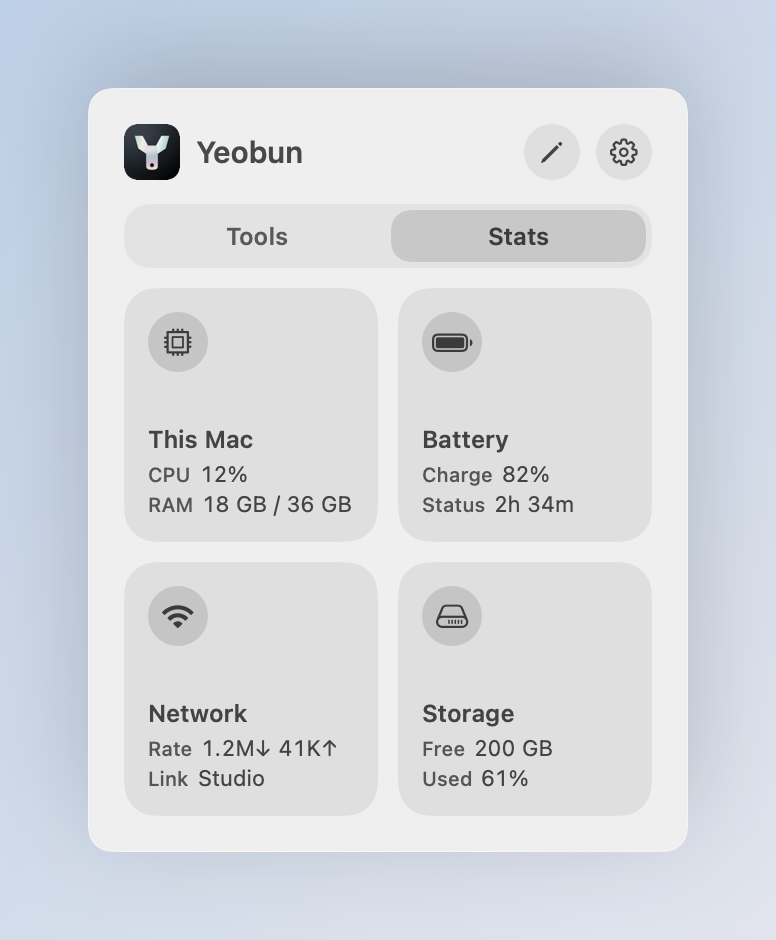
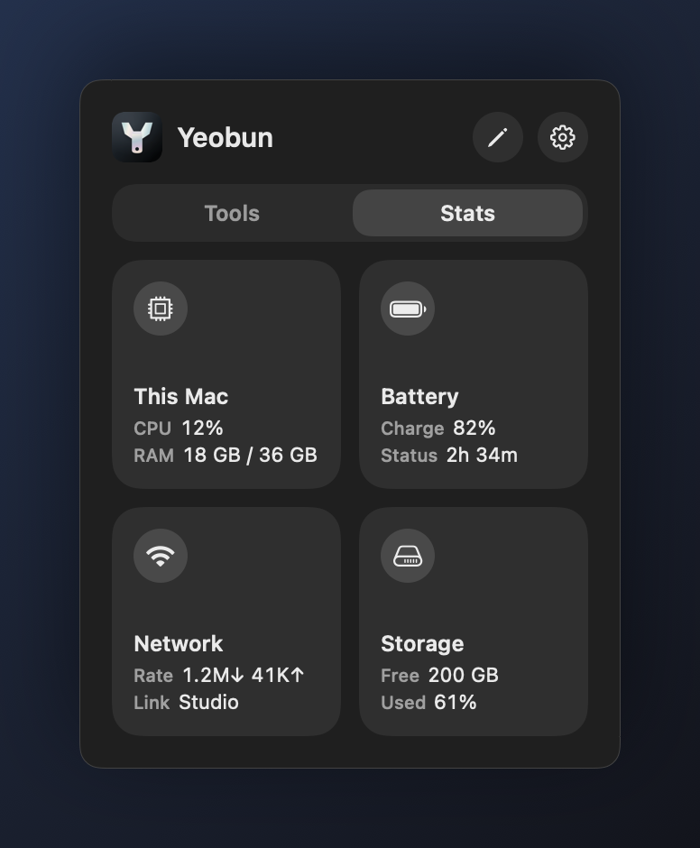

Click the wrench to open a two-column grid. **Tools** and **Stats** are tabs; the last one you used is remembered. Click a tile’s **icon** to toggle it. Click the rest of the tile for options. The **gear** opens Settings.

## Install

Homebrew:

```sh
brew install --cask n6-studio/tap/yeobun
```

Or tap first, then install:

```sh
brew tap n6-studio/tap
brew trust --tap n6-studio/tap
brew install --cask yeobun
```

Homebrew 6 asks you to trust `n6-studio/tap` the first time. The one-line install trusts only this cask.

Or download the disk image from the [latest GitHub release](https://github.com/n6-studio/yeobun/releases/latest) and drag **Yeobun** onto **Applications**. Open it, then look for the wrench in the menu bar. Drag the icon left if macOS tucks it behind the extra-items chevron.

If Gatekeeper blocks it, right-click the app → Open. The release is signed locally, not notarized.

Requires macOS 14 or later.

## Tools

Active tiles fill with their color.

### Built-in keyboard

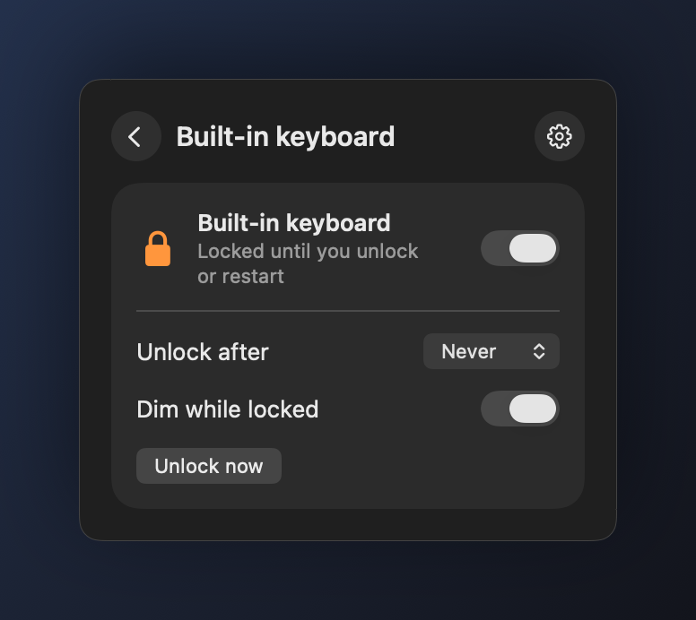

Disables the MacBook's **built-in keyboard**. The trackpad, any external keyboard, Touch ID, and the power button keep working. A reboot always unlocks the keys.

Optional **Unlock after** (5–60 minutes) is for wiping the keyboard down. **Dim while locked** turns the backlight off while the keys are ignored.

### Scroll reverse

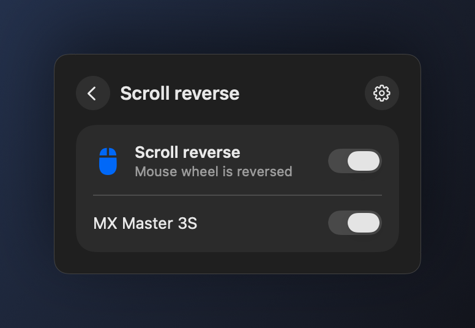

Reverses **mouse wheel** scrolling so a mouse feels classic while the **trackpad stays natural**. Each mouse can be switched on its own. Needs Accessibility; the panel will ask if it is missing.

### Lid awake


Keeps the Mac on **battery** when the lid is shut. The first toggle asks for an administrator password once; later switches do not. The setting stays until you turn it off — quitting the app does not restore sleep.

A closed MacBook with nowhere to dump heat can get hot. Switch it off when you are done.

### Keep awake

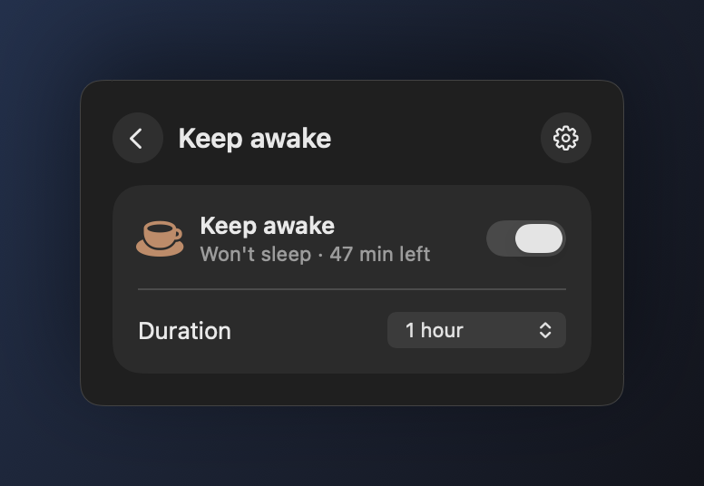

Blocks idle sleep and display sleep. Turn it on indefinitely, or pick a duration first (5 minutes through 5 hours). The tile shows time left. Quitting the app does not drop the hold.

Lid awake is the closed-lid case. Keep awake only blocks idle sleep while the lid is open.

### Hidden icons

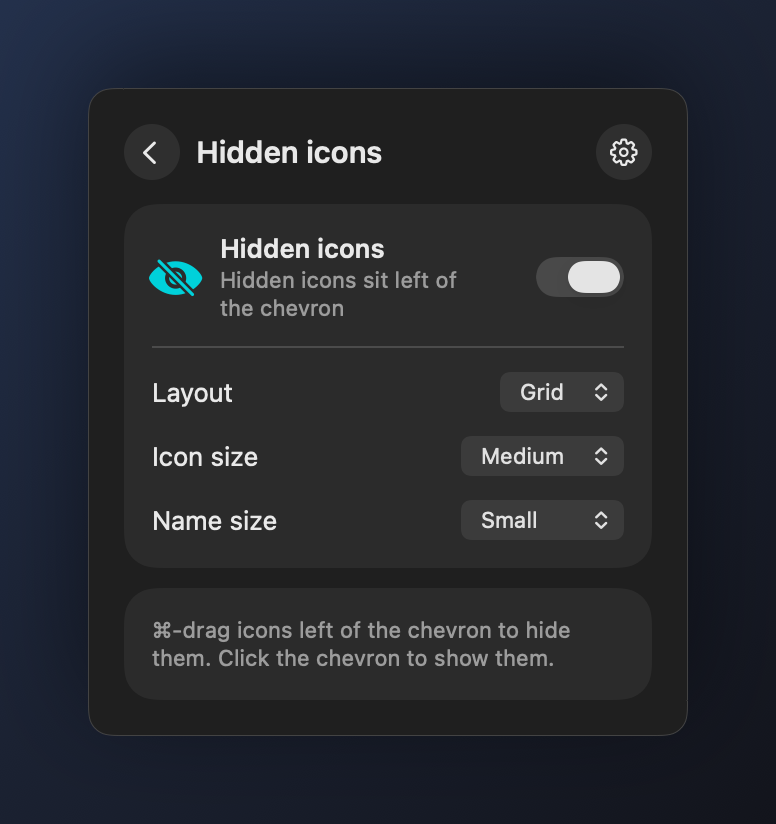

A **chevron** in the menu bar that opens hidden icons, in the spirit of [Ice](https://github.com/jordanbaird/Ice)'s Ice Bar. Click it and a small panel lists status items that are off screen or that their app removed from the bar (⌘-dragged out, or hidden in the app's settings). Click a tile and the item's own menu pops up right there; choosing an entry runs it in the real app. Items without a menu are pressed directly. Click the chevron again, or anywhere else, to close it.

⌘-drag icons to the left of the chevron and they leave the bar; they stay one chevron click away. **Layout** is a grid or a vertical list. **Icon size** and **Name size** set how those tiles draw.

Finding the icons needs **Accessibility**: on macOS 26 off-screen items are not in the window list, so Yeobun asks each app for its own menu bar extras. **Screen Recording** is optional and draws each app's real icon instead of a generic one.

If the chevron ends up on the wrong side of the hidden icons, they stay shown and the tile tells you to ⌘-drag it back to the right.

## Stats

Informational only. Sampled while the panel is open, and in the menu bar if you turn on a glance.

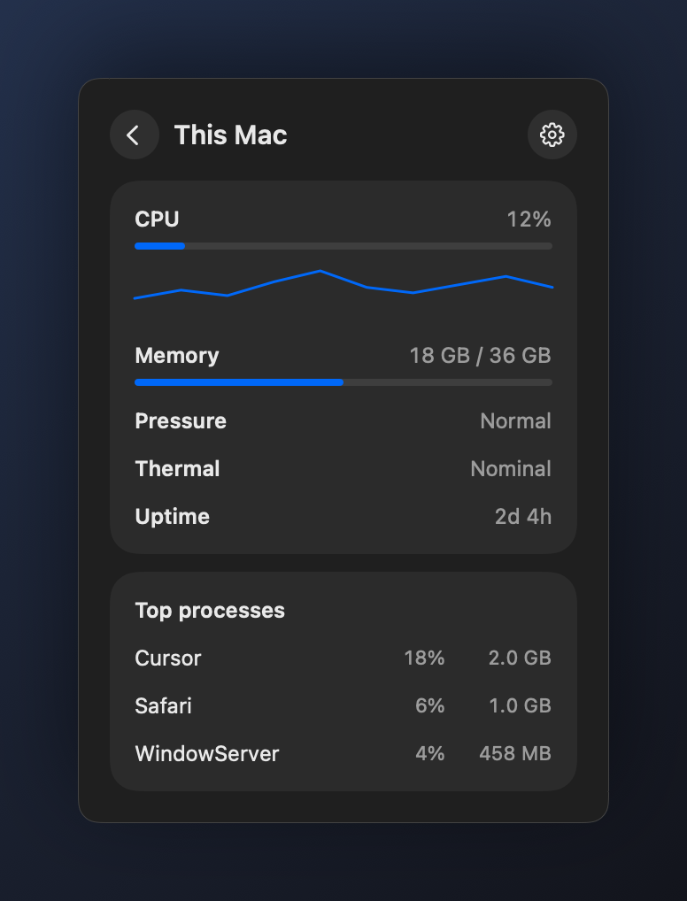
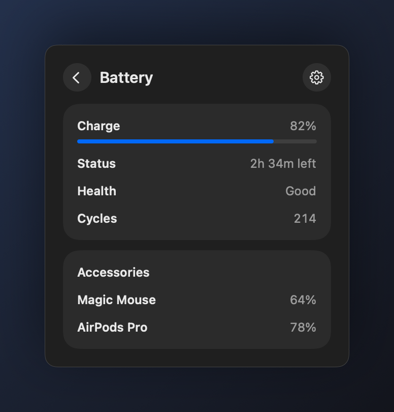

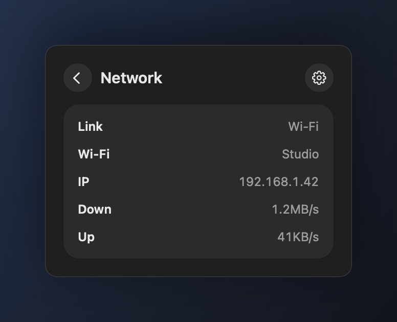
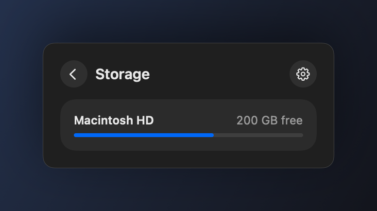

- **This Mac** — live CPU and RAM on the tile; detail adds pressure, swap, thermal state, uptime, and the top processes.
- **Battery** — charge, time remaining, health, and cycle count. Bluetooth accessories when macOS reports a percentage. On a desktop the tile reads “No battery”.
- **Network** — link type, Wi-Fi name when macOS allows it, local IP, live down/up.
- **Storage** — used and free space on the boot volume, plus other mounted disks.

## Settings

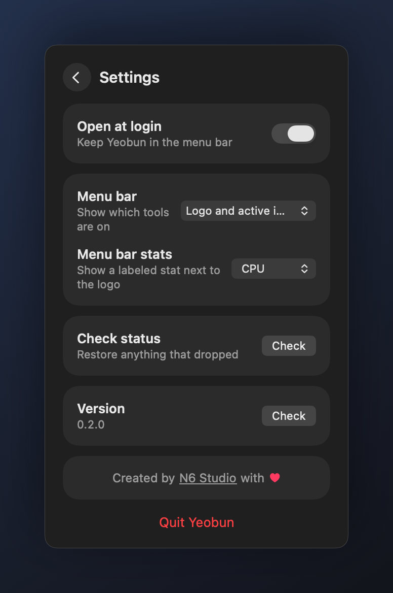

- **Open at login** — keep Yeobun in the menu bar (on by default).
- **Menu bar** — logo only, icons for tools that are on, or both. The logo stays when nothing is on, so you can still find the app.
- **Menu bar stats** — optional CPU, battery, or network next to the logo, with a small label above the value.
- **Check status** — read each tool from this Mac and restore anything that dropped.

Right-click the menu-bar item for the same toggles without opening the panel.

## CLI

`./build.sh` also installs `yeobun` at `~/.local/bin/yeobun`. After a disk-image install, the same binary lives at `/Applications/Yeobun.app/Contents/MacOS/yeobun-cli`. Add `~/.local/bin` to `PATH` if it is not there already.

```sh
yeobun status --json
yeobun keyboard on --minutes 15
yeobun scroll on
yeobun lid off
yeobun awake on --minutes 60
yeobun menubar on
yeobun mac
```

Every command accepts `--json`. Exit codes: `0` ok, `1` failed, `2` usage, `3` permission. `yeobun --help` is the full contract.

## From source

```sh
./build.sh
open ~/Applications/Yeobun.app
```

## Notes

- Built-in keyboard and Keep awake need no extra permission.
- Scroll reverse needs Accessibility.
- Lid awake asks for an administrator password once.
- Built-in keyboard lasts until you unlock or reboot. Sleep can drop the mapping; the app re-applies it if the lock was still on. Scroll reverse and Keep awake keep running after Quit until you turn them off. Lid awake stays until you turn it off.
