# Yeobun


[](https://github.com/n6-studio/yeobun/releases/latest)
[](https://n6.studio/)

**A menu-bar panel for the extras macOS did not ship. No Dock icon.**  
Lock the built-in keyboard. Reverse mouse scroll. Stay on with the lid closed. Keep the Mac awake. Hide menu bar icons behind a chevron. Type what you say. Glance at this Mac.

*Yeobun* is from Korean **여분**: spare, extra.

<table>
<tr>
<td>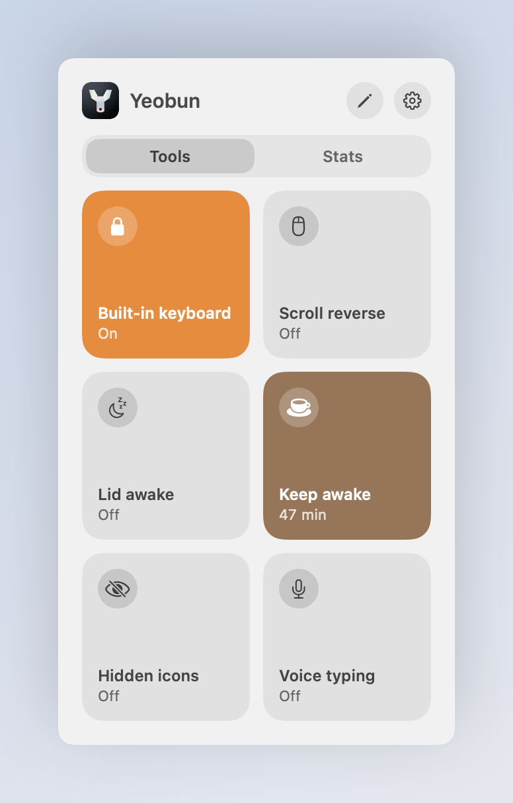</td>
<td>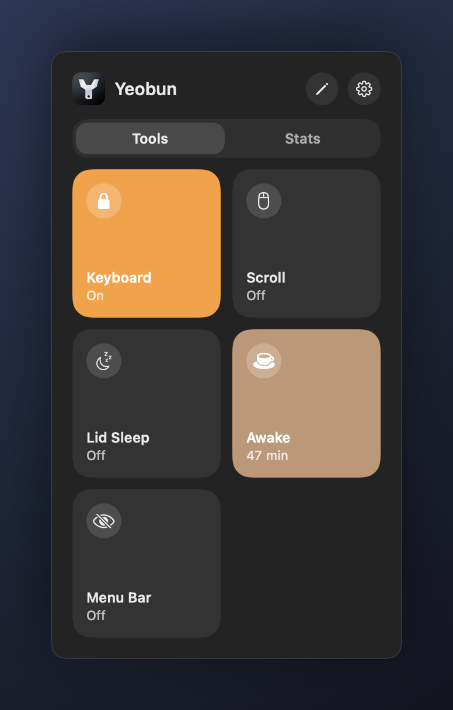</td>
</tr>
</table>

Click the wrench to open the panel. The boxes on top are stats you pin from Mac or a remote. Each tool is a row: the **switch** turns it on, and the rest of the row opens options. The **gear** opens Settings.

## Install

Homebrew:

```sh
brew install --cask n6-studio/tap/yeobun
```

Or tap first, then install:

```sh
brew tap n6-studio/tap
brew trust --tap n6-studio/tap
brew install --cask yeobun
```

Homebrew 6 asks you to trust `n6-studio/tap` the first time. The one-line install trusts only this cask.

Or download the disk image from the [latest GitHub release](https://github.com/n6-studio/yeobun/releases/latest) and drag **Yeobun** onto **Applications**. Open it, then look for the wrench in the menu bar. ⌘-drag to reorder; Yeobun puts itself back if it is dragged off the bar, because there is no Dock icon.

Requires macOS 14 or later.

## Quarantine

Yeobun is not signed with an Apple Developer ID. macOS marks a downloaded app as quarantined, and Gatekeeper then refuses to open it. After Yeobun is in Applications, clear the flag:

```sh
xattr -dr com.apple.quarantine /Applications/Yeobun.app
```

Then open Yeobun. You can also right-click the app and choose Open.

## Tools

On rows take a wash of their color. The switch is the control.

### Built-in keyboard

<table>
<tr>
<td>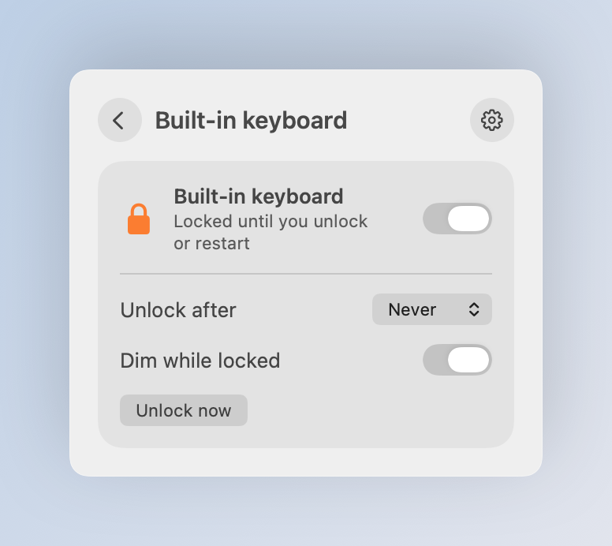</td>
<td>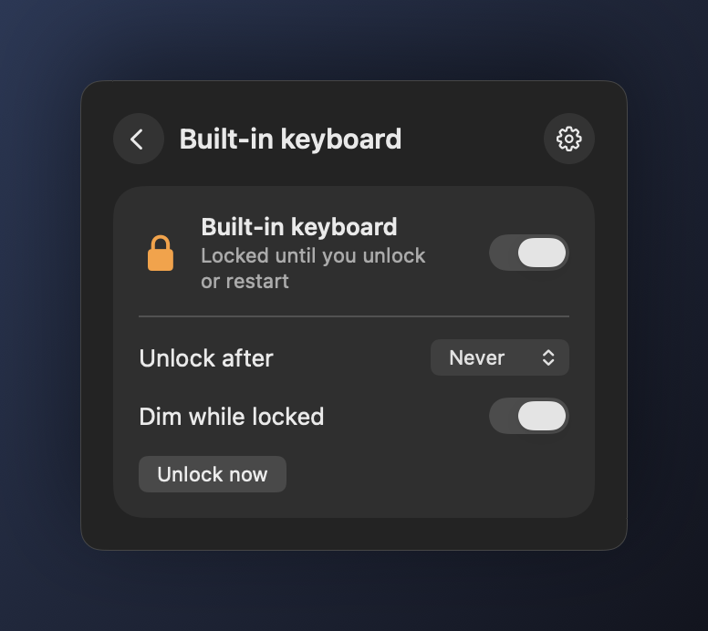</td>
</tr>
</table>

Disables the MacBook's **built-in keyboard**. The trackpad, any external keyboard, Touch ID, and the power button keep working. A reboot always unlocks the keys.

Optional **Unlock after** (5–60 minutes) is for wiping the keyboard down. **Dim while locked** turns the backlight off while the keys are ignored.

### Scroll reverse

<table>
<tr>
<td>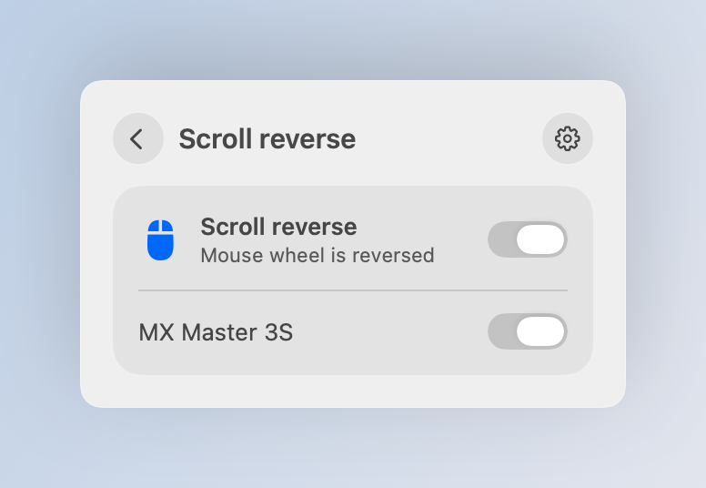</td>
<td>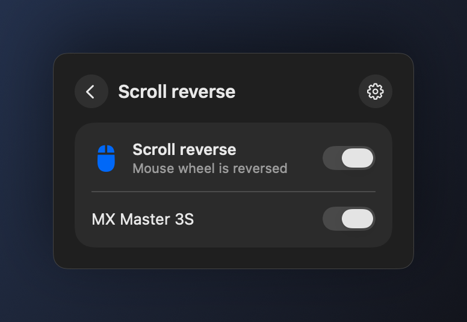</td>
</tr>
</table>

Reverses **mouse wheel** scrolling so a mouse feels classic while the **trackpad stays natural**. Each mouse can be switched on its own. Needs Accessibility; the panel will ask if it is missing.

### Lid awake

<table>
<tr>
<td>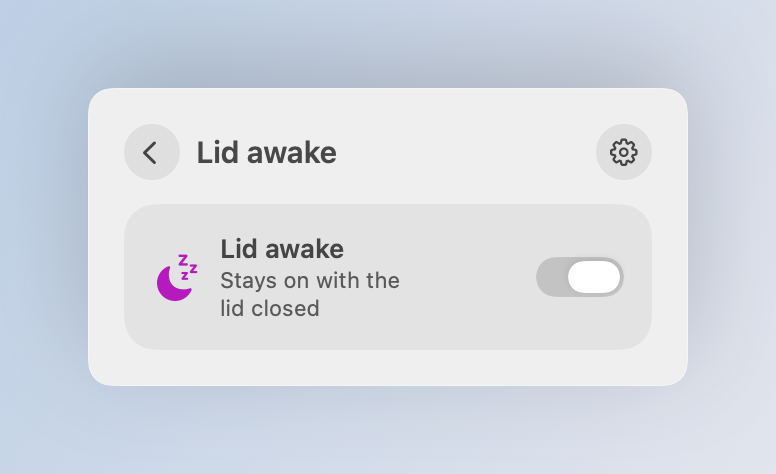</td>
<td>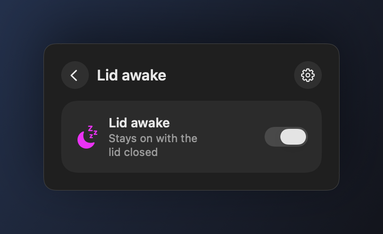</td>
</tr>
</table>

Keeps the Mac on **battery** when the lid is shut. The first toggle asks for an administrator password once; later switches do not. The setting stays until you turn it off — quitting the app does not restore sleep.

A closed MacBook with nowhere to dump heat can get hot. Switch it off when you are done.

### Keep awake

<table>
<tr>
<td>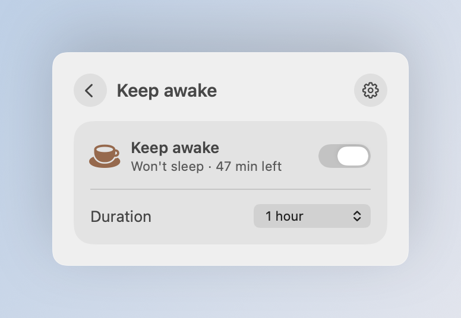</td>
<td>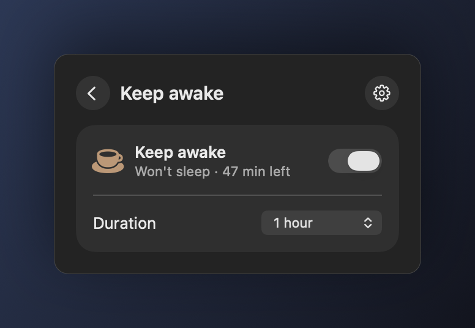</td>
</tr>
</table>

Blocks idle sleep and display sleep. Turn it on indefinitely, or pick a duration first (5 minutes through 5 hours). The row shows time left. Quitting the app does not drop the hold.

Lid awake is the closed-lid case. Keep awake only blocks idle sleep while the lid is open.

### Hidden icons

<table>
<tr>
<td>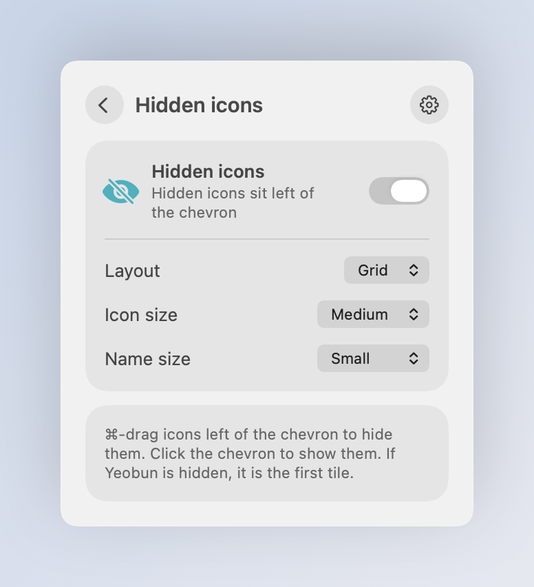</td>
<td>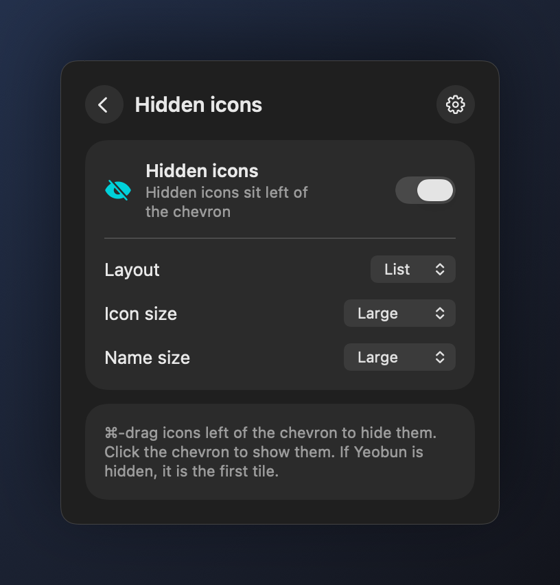</td>
</tr>
</table>

A **chevron** in the menu bar that opens hidden icons, in the spirit of [Ice](https://github.com/jordanbaird/Ice)'s Ice Bar. Click it and a small panel lists status items that are off screen or that their app removed from the bar (⌘-dragged out, or hidden in the app's settings). If Yeobun's own icon is among them, it is the first tile and opens the panel. Click or right-click a tile and the item's own menu pops up right there; choosing an entry runs it in the real app and closes the strip. Dismissing that menu without choosing leaves the strip open. Items without a menu are pressed directly. Click the chevron again, or anywhere else, to close it.

⌘-drag icons to the left of the chevron and they leave the bar; they stay one chevron click away. **Layout** is a grid or a vertical list. **Icon size** and **Name size** set how those tiles draw.

Finding the icons needs **Accessibility**: on macOS 26 off-screen items are not in the window list, so Yeobun asks each app for its own menu bar extras. **Screen Recording** is optional and draws each app's real icon instead of a generic one.

If the chevron ends up on the wrong side of the hidden icons, they stay shown and the row tells you to ⌘-drag it back to the right.

### Voice typing

<table>
<tr>
<td>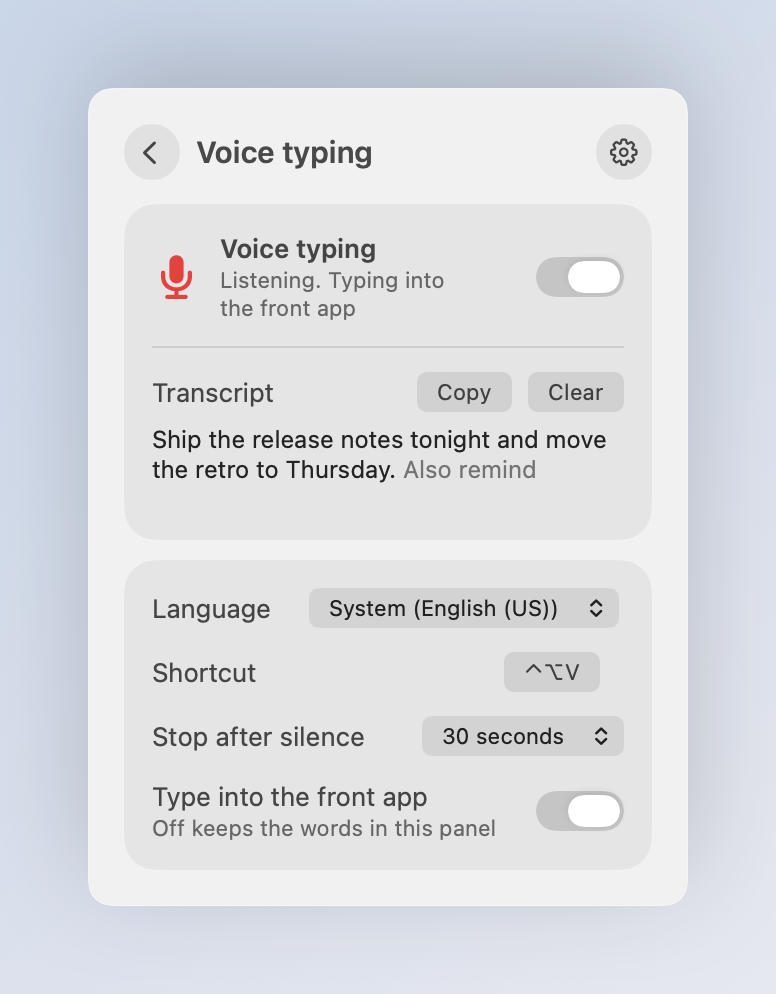</td>
<td>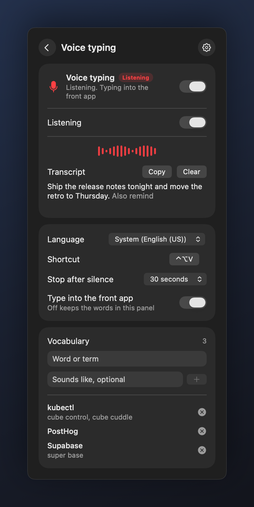</td>
</tr>
</table>

Turn the tool on, then press **⌃⌥V** in any app and start talking. The row is the master switch: while it is off the shortcut is not registered and nothing can listen. **Listening** is a separate switch that only works while the tool is on. Yeobun turns speech into text **on this Mac** and types it where your cursor is while you are still talking. When the recognizer changes its mind about a word, Yeobun backspaces over it and types the correction. Press the shortcut again to stop, or leave a pause and it stops on its own (**Stop after silence**, 15 seconds to 1 minute, or never). The row reads **Listening** during a session, the right-click menu gains Start and Stop Listening, and the words also collect in the panel with **Copy** and **Clear**.

**Language** defaults to the system language. On macOS 26 Yeobun uses the same on-device model as system dictation and downloads a language the first time you pick it. On macOS 14 and 15 it uses the older on-device recognizer, which needs the language downloaded under System Settings › Keyboard › Dictation. Nothing is sent to a server.

Click **Shortcut** to record a different key combination. **Type into the front app** off keeps the words in the panel only.

**Vocabulary** is for the names and technical terms it keeps getting wrong. Add a term spelled the way you want it written, such as `PostHog`. The recognizer takes the list as a hint, which is enough for words it half knows, and the term always comes out with your spelling and capitals. For words it has never seen, fill in **Sounds like** with what it writes instead today, separated by commas: `kubectl` with `cube control, cube cuddle`. Those are rewritten to the term, as whole words only, while you talk. Up to 100 terms, shared by every language, and changes apply to a session that is already listening.

Needs **Microphone**. Typing into other apps needs **Accessibility**, the same permission as Scroll reverse; without it the transcript still shows in the panel. Text goes in as key presses, so the clipboard is left alone. Keep the cursor where it is until a phrase settles, because corrections backspace from there.

## Stats

Informational only. Pin CPU, memory, storage, network, power, or battery from Mac or a remote and it stays in the boxes on Home. **Mac** is a row; its page includes storage. Each remote is a row. Sampled while the panel is open, and in the menu bar if you turn on a stat.

<table>
<tr>
<td>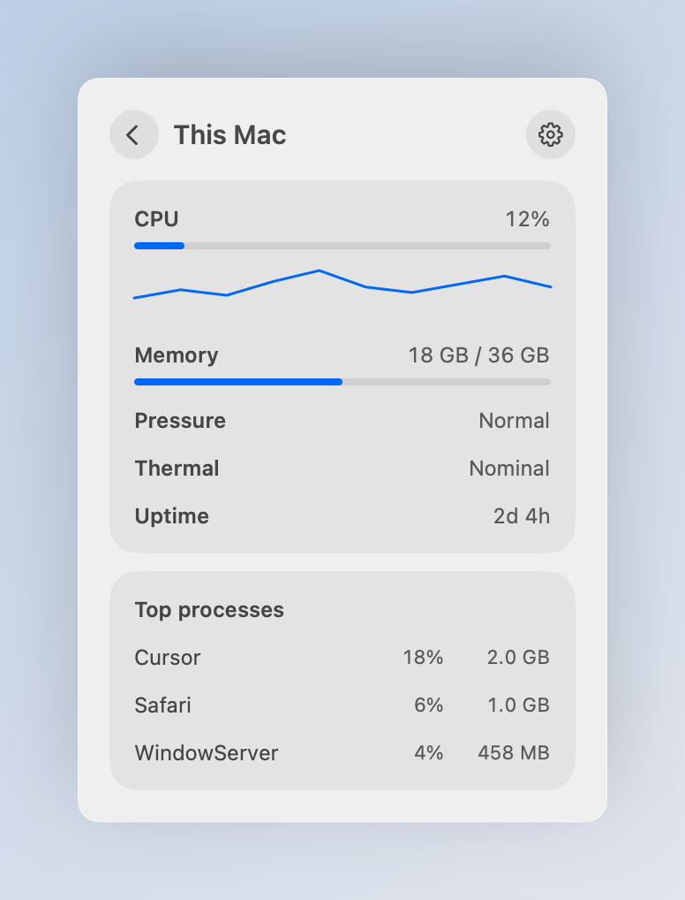</td>
<td>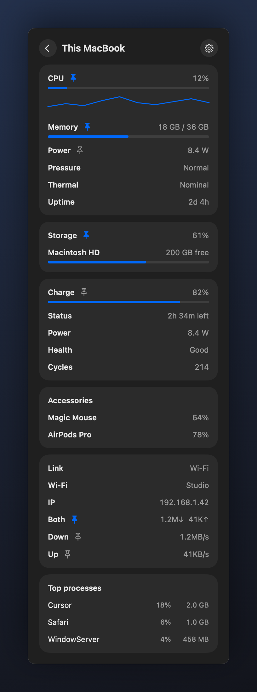</td>
</tr>
<tr>
<td>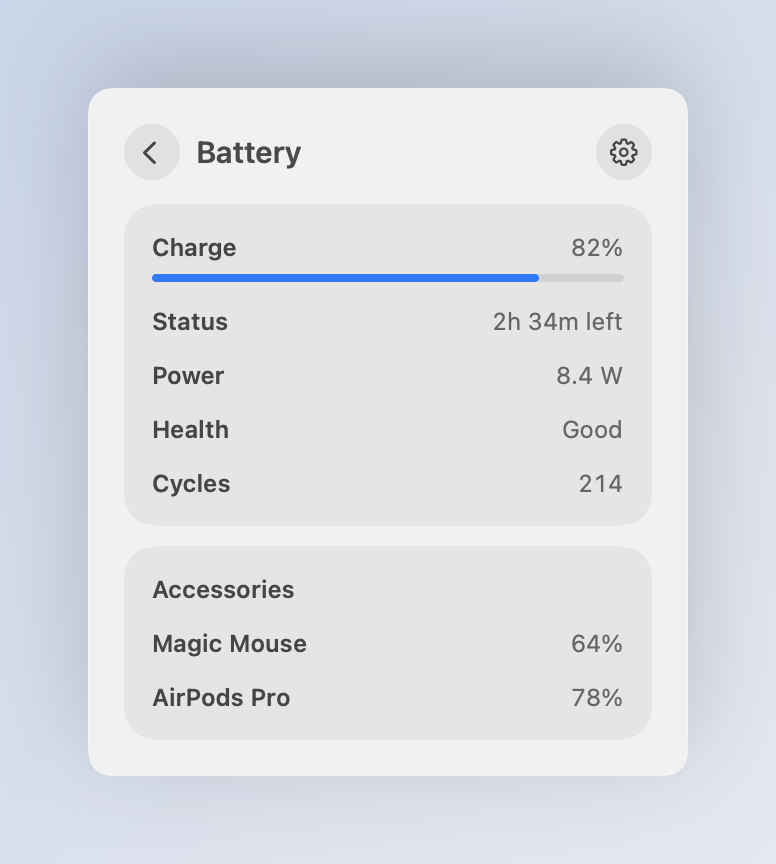</td>
<td>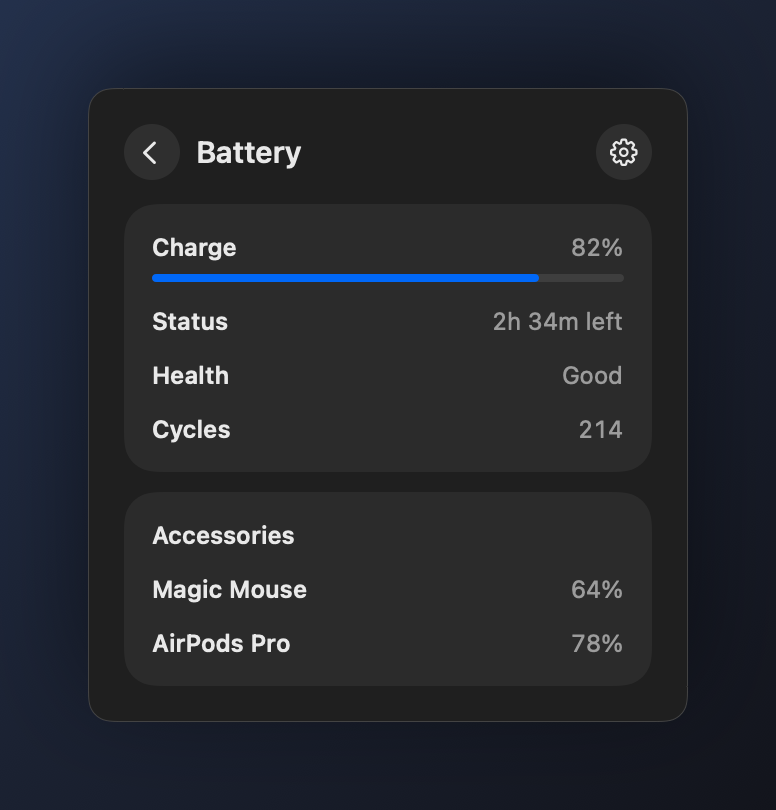</td>
</tr>
<tr>
<td>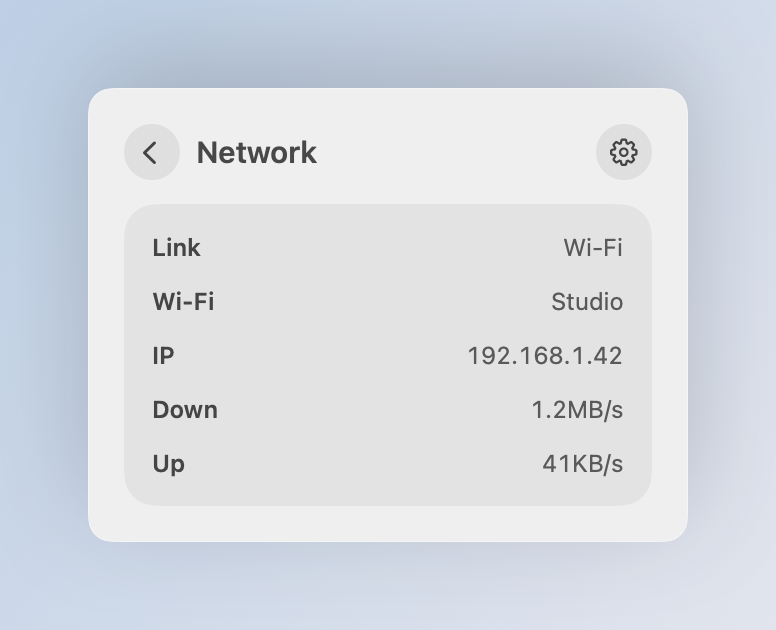</td>
<td>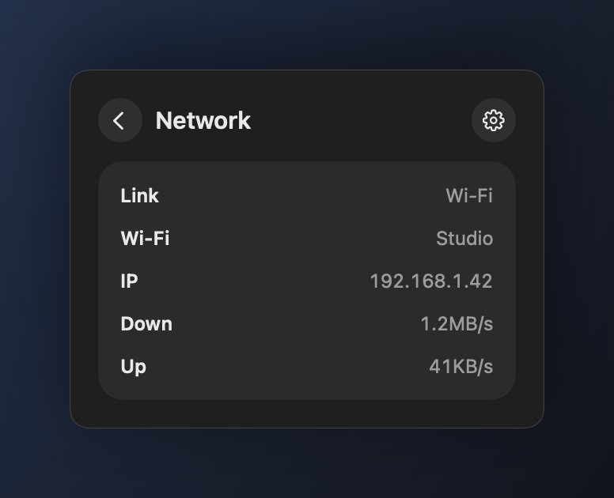</td>
</tr>
<tr>
<td>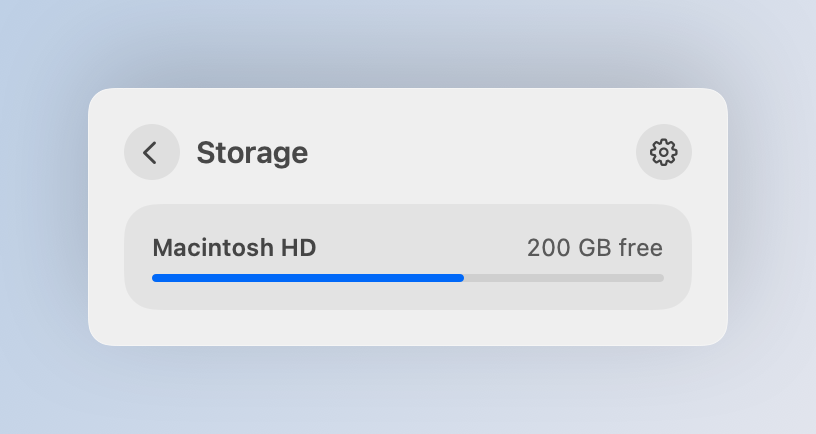</td>
<td>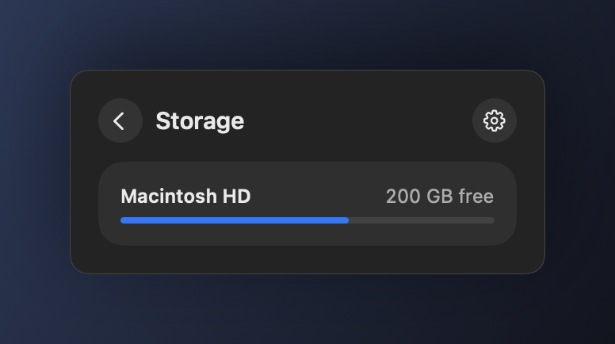</td>
</tr>
<tr>
<td>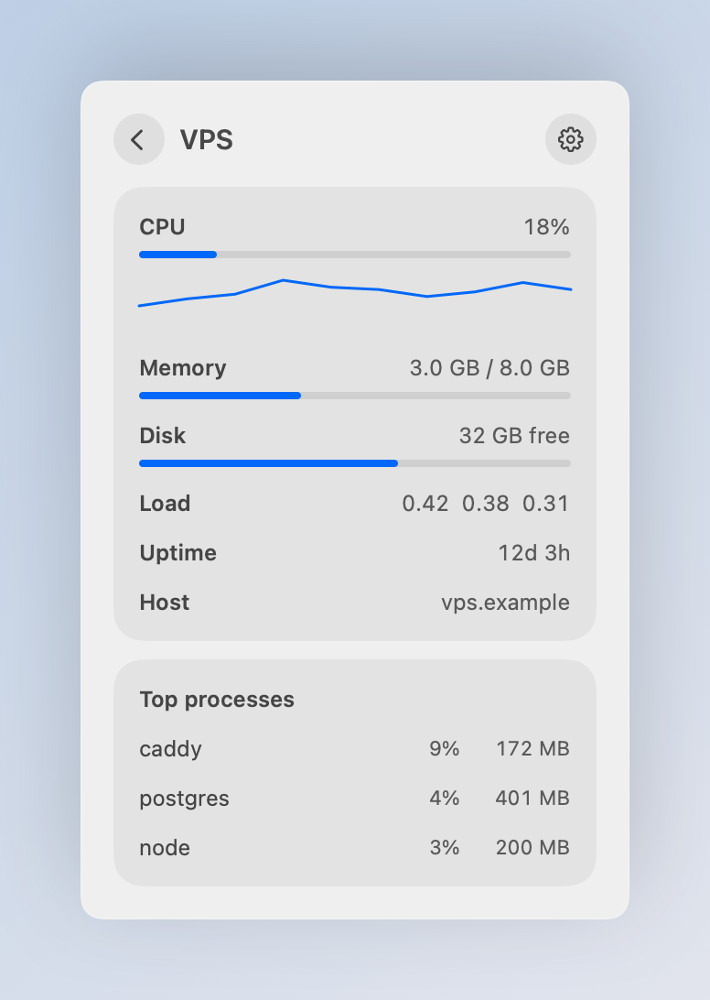</td>
<td>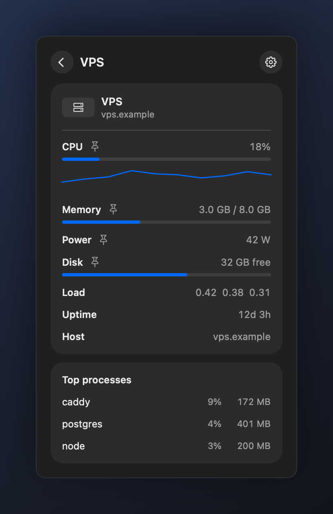</td>
</tr>
</table>

- **Mac** — a home row. CPU, memory, and power, plus storage for the boot volume and other disks. Pin any of those to Home.
- **Remote** — SSH hosts you add. Pick an icon so the row and any pinned stat are easy to tell from this Mac. Detail adds CPU, RAM, power, disk, load, uptime, and top processes. Linux only. Uses `/usr/bin/ssh` with your keys or ssh-agent (no passwords). Host can be an `~/.ssh/config` alias.
- **Battery** — charge, time remaining, power, health, and cycle count. Bluetooth accessories when macOS reports a percentage. Pin charge to Home if you want it in the boxes.
- **Network** — link type, Wi-Fi name when macOS allows it, local IP, live down/up.
- **Storage** — used and free space on the boot volume, plus other mounted disks.

## Settings

<table>
<tr>
<td>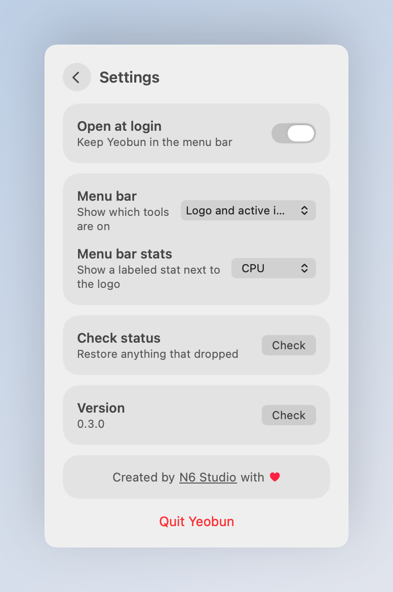</td>
<td>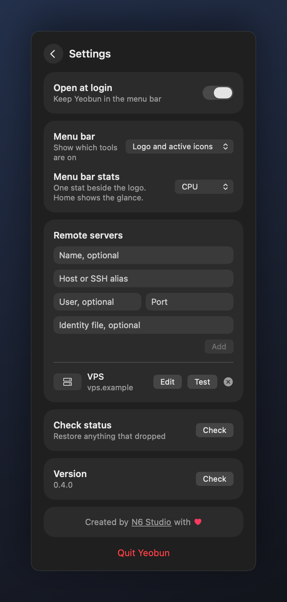</td>
</tr>
</table>

- **Open at login** — keep Yeobun in the menu bar (on by default).
- **Menu bar** — logo only, icons for tools that are on, or both. The logo stays when nothing is on, so you can still find the app.
- **Menu bar stats** — optional CPU, battery, or network next to the logo, with a small label above the value. Home already shows the four-up glance.
- **Remote servers** — add an SSH host (or config alias) to glance at its load from Home. Needs a key in ssh-agent or `~/.ssh`. Up to 8 hosts.
- **Check status** — read each tool from this Mac and restore anything that dropped.

Right-click the menu-bar item for the same toggles without opening the panel.

## CLI

`./build.sh` also installs `yeobun` at `~/.local/bin/yeobun`. After a disk-image install, the same binary lives at `/Applications/Yeobun.app/Contents/MacOS/yeobun-cli`. Add `~/.local/bin` to `PATH` if it is not there already.

```sh
yeobun status --json
yeobun keyboard on --minutes 15
yeobun scroll on
yeobun lid off
yeobun awake on --minutes 60
yeobun menubar on
yeobun voice on
yeobun voice start
yeobun voice vocab add kubectl --sounds-like "cube control"
yeobun mac
yeobun remote add vps --name VPS
yeobun remote status
```

Every command accepts `--json`. Exit codes: `0` ok, `1` failed, `2` usage, `3` permission. `yeobun --help` is the full contract.

## From source

```sh
./build.sh
open ~/Applications/Yeobun.app
```

## Notes

- Built-in keyboard and Keep awake need no extra permission.
- Scroll reverse needs Accessibility. Voice typing needs Microphone, plus Accessibility to type into other apps.
- `yeobun voice on|off` is the master switch and is remembered. `yeobun voice start|stop` controls listening and needs the app open; the CLI never touches the microphone.
- `yeobun voice vocab` lists the vocabulary; `vocab add <term> [--sounds-like <text>]`, `vocab remove <term>`, and `vocab clear` edit it. Adding a term that is already there merges the new sounds-like entries into it. The list is also under `voice.vocabulary` in the status JSON.
- `yeobun remote` lists saved SSH servers. `remote add <host> [--name] [--user] [--port] [--identity]` and `remote remove <name-or-id>` edit the list. `remote status` probes live CPU, RAM, load, disk, and power (Linux). Human `yeobun status` only reports how many remotes are configured; live numbers are `yeobun remote status`. Power is live watts when the host exposes them. Linux RAPL is often root-only, and many VMs report none.
- Lid awake asks for an administrator password once.
- Built-in keyboard lasts until you unlock or reboot. Sleep can drop the mapping; the app re-applies it if the lock was still on. Scroll reverse and Keep awake keep running after Quit until you turn them off. Lid awake stays until you turn it off.
